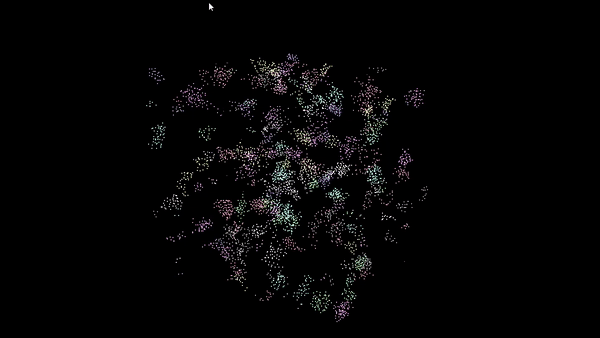

**University of Pennsylvania, CIS 565: GPU Programming and Architecture,
Project 1 - Flocking**

* Srinath Rajagopalan
  * [LinkedIn](https://www.linkedin.com/in/srinath-rajagopalan-07a43155), [twitter](https://twitter.com/srinath132)
* Tested on: Windows 10, i7-6700 @ 3.4GHz 16GB, Nvidia Quadro P1000 4GB (Moore 100B Lab)

## Simulating Boids

For this project, we will be simulating the motion of boids (objects representing birds/fish) by making them adhere to certain rules governing their velocity. The rules are 

1. cohesion - boids move towards the perceived center of mass of their neighbors
2. separation - boids avoid getting to close to their neighbors
3. alignment - boids generally try to move with the same direction and speed as
their neighbors

The final simulation using for `N=5000` boids and `N=20000` boids




### Velocity Update

Initially all the boids assume a random position in space. We create the simulation by calculating their velocities (derived from the 3 rules) and updating their positions. By introducing _parallelism_ we can enforce all the rules for the N boids with N threads where each thread computes the velocity update for the corresponding boid. The naive approach is for each boid to check the other N-1 boids, find who are all its neighbours, and compute the velocity update. This would be implemented as follows:

#### Rule 1: Boids try to fly towards the centre of mass of neighbouring boids

```
function rule1(Boid boid)

    Vector perceived_center
    foreach Boid b:
        if b != boid and distance(b, boid) < rule1Distance then
            perceived_center += b.position
        endif
    end

    perceived_center /= number_of_neighbors

    return (perceived_center - boid.position) * rule1Scale
end
```

#### Rule 2: Boids try to keep a small distance away from other objects (including other boids).

```
function rule2(Boid boid)

    Vector c = 0
    foreach Boid b
        if b != boid and distance(b, boid) < rule2Distance then
            c -= (b.position - boid.position)
        endif
    end

    return c * rule2Scale
end
```

#### Rule 3: Boids try to match velocity with near boids.

```
function rule3(Boid boid)

    Vector perceived_velocity
    foreach Boid b
        if b != boid and distance(b, boid) < rule3Distance then
            perceived_velocity += b.velocity
        endif
    end

    perceived_velocity /= number_of_neighbors

    return perceived_velocity * rule3Scale
end
``` 

However, this approach is extremely inefficient because each boid is performing N-1 checks when it would only have a small number of potential neighbours. So a more efficient approach is to do a pre-processing step by binning the boids in space with the help of a cell grid. Let's say the simulation space is a cube enclosing all the boids. Divide the cube into cells where each cell is of dimension `(gridCellWidth, gridCellWidth, gridCellWidth)`. Now if the cell width is `2 * neighbourDistance`, each boid has to only check the boids present in the 8 surrounding cells. This drastically reduces the search space. By controlling the cell width we can limit the number of neighbouring cells we have to check. The following grid illustrates this.


How to construct the uniform grid in parallel?

## Unfiform Grid Cell construction

```
1. Construct an array of size N- boidIndices[0..N-1] where boidIndices[i] = i
2. Construct an array of size N- gridIndices[0..N-1] where gridIndices[i] is the grid to which boid i belongs.
3. Sort arrays boidIndices and gridIndices based on the value of gridIndices. Now gridIndices is in ascending order where gridIndices[i] is the grid to which the boid boidIndices[i] belongs.
4. Construct two arrays of size gridCellCount each - gridCellStart and gridCellEnd - where gridCellStart[g] and gridCellEnd[g] are the range of positions (in the boidIndices/gridIndices arrays) representing the boids belonging to grid g. 
```

The above is represented by the following diagram:


Once we have this, for each boid, we figure out the potential neighbour grid cells (which is 8 if gridCellWidth = 2 * neighbourDistance). Now with the uniform grid constructed as above, we can access all the boids present in neighbouring cells and compute the velocity update.

## Coherent Search

In the above uniform grid construction, we access the position and velocity of neighbouring boids by getting their index from `boidIndices` array using that to retrieve `pos[boidIndices[i]]` and `vel[boidIndices[i]]`. This is a _scattered_ search because we are continuously accessing position and velocity values from non-contiguous memory locations. If `pos` and `vel` _also_ algined with `gridIndices` and `boidIndices` we can directly access the positions of neighbouring boids in a grid cell with `gridCellStart` and `gridCellEnd`: `pos[gridCellStart[g]]` to `pos[gridCellEnd[g]]` gives the positions of all the potential boids. Therefore we also sort the position and velocity arrays by the value of `gridIndices`. But, since we have already sorted `boidIndices` using a simple shuffle trick we can rearrange `pos` data to reflect the sort. Now since the data is stored in contiguous locations in memory, we can get efficient memory access (blocks of data will be cached locally we might not have hit the global memory for every iteration). This is reflected in the following diagram,


### Performance Analysis

We measure the time (in milliseconds) taken for one complete simulation step using CUDA events. The analgous FPS is measured as `1000/(time_taken)`. The time taken is averaged over 1000 simulation steps. 

1. How does changing the number of boids affect performance? Why do you think this is?

<p align='center'>

</p>

<p align='center'>

</p>

<p align='center'>

</p>

In all cases, performance drops with increasing number of boids. This is expected, more boids mean more calculations we have to perform as our potential neighbours increase (since the volume is kept constant, density has to increase) and we have more boids to calculate the velocity update for. Theoretically, if we had very large number of processors to execute all the threads in a truly parallel way, only the dense neighbours affect the performance and not the total number of velocity updates. 

2. For the coherent uniform grid: did you experience any performance improvements
with the more coherent uniform grid? Was this the outcome you expected? Why or why not?

From the graphs we see that, we get better performance for scattered search over naive search (unsurprisingly). The unfigorm grid construction drastically reduces the search space per boid (as explained in the before sections). Coherent search improves upon scattered search by utilizing efficient memory access. This is not apparent till we increase the number of boids to a large number. With Coherent, we are able to simulate upto 1M boids  but only 500k boids for the scattered search. Naive search fails beyond 50k boids.

3. How does changing the block count and block size affect performance? Why do you think this is?

The following graph is plotted for scattered search with 50,000 boids.

<p align='center'>

</p>

Since we are using the formula `blockSize * numberOfBlocks = N`, increasing block size decreases number of blocks. So we only check for different block sizes (8, 128, 1024), the extreme cases to see if there is a trend. The performance impact is not noticeable after block size = 128. But for an absurdly small number of threads per block (N = 8), the performance dropped quite significantly. This is probably because of the overhead in launching and scheduling a large number of blocks as opposed to launching fewer blocks.

4. Did changing cell width and checking 27 vs 8 neighboring cells affect performance?
Why or why not?

The following graph is plotted for scattered search with 50,000 boids.

<p align='center'>

</p>

As discussed before, the cell width controls the number of surrounding grid cells we have to search for. For the extreme cases, with a very large cell width, we check 1 cell but ALL the boids within that cell. If the cell width is small, we check MORE number of grid cells but fewer number boids within that cell. So we have to strike a trade-off. We see that cell width (as a function of neighbouring distance) of 2x is the sweet spot. 


